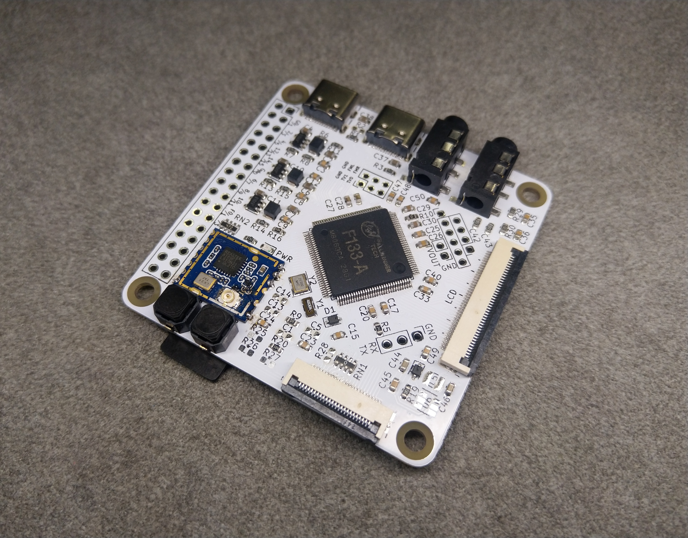
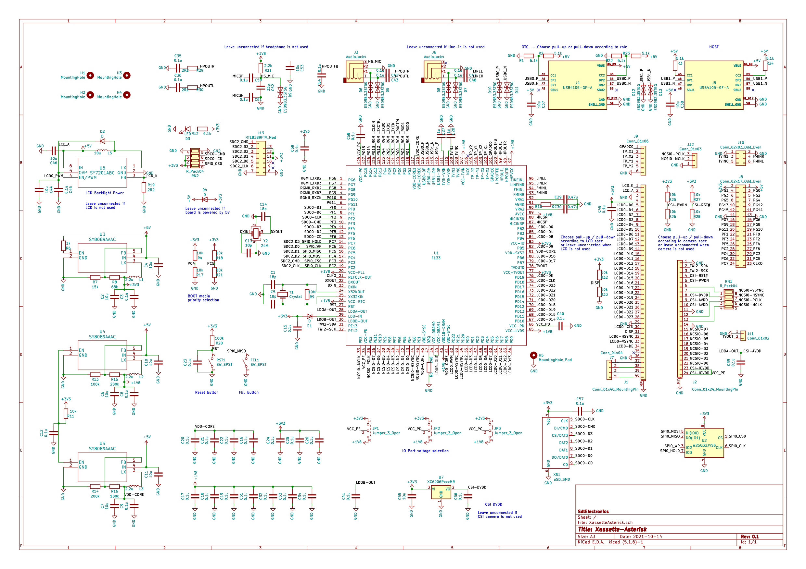

# Xassette-Asterisk
Evaluation board for AllWinner's RISC-V 64 SoC F133/D1s

## Highlights
* Breaks out all IOs, involving analog peripherals, in a compact 56*56mm 2-layer board
* Comes with standard interfaces including USB, micro SD, LCD, Line-in and headphone
* Optimized components arrangement for soldering on heating tables

## About the Chip
D1s/F133: RISC-V 64 single core @1.008G with in package 64MB DDR2

## Schematic

The schematic in KiCAD format is available under [hw](hw/).

## Notes
* Leave all BOOT selection resistors unconnected if only one BOOT media is present
* Choose load capacitors according to specs of crystals
* When board is to be powered by 3.3V, connect to the power via the 3.3V pin of the pinheader, and `D4` should be soldered. Note USB host will not work properly in this condition due to the absence of 5V power.

## Licence
This project is available under the [CERN OHL-w v2](https://ohwr.org/project/cernohl/wikis/Documents/CERN-OHL-version-2) licence. 